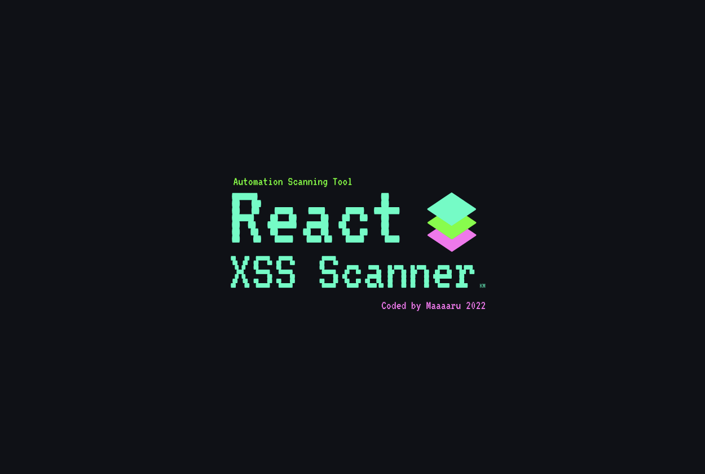
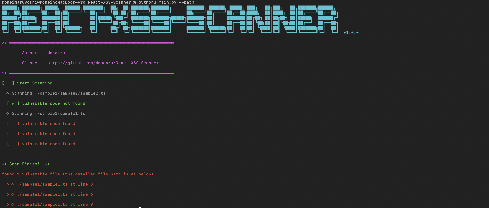

<p align="center">
  
</p>

<h1></h1>

<p align="center">
This scanner for vulnerabilities in React code. (.ts, .tsx, .js, .jsx)
</p>


# What is this
This tool scans files for the presence of dangerous functions that can cause XSS.

# Why React-XSS-Scanner?
There are many tools that inject xss payloads into specified URLs, but I couldn't find many tools that scan for dangerous code that could cause xss, so I created this one.


# Instalation

clone this repository

```
$ git clone https://github.com/Maaaaru/React-XSS-Scanner.git
```

# Start Scan



```
$ cd React-XSS-Scanner
$ python3 main.py --path ../
```

# Flags
| Long Form | Short Form | Description |
| ----| ---- | ---- |
| --help | -h | help message |
| --path | -P | Directly path to scan. The default path is specified as the directly above the current directly. |

There are currently only two flags, but more will be added in the future, including output to files.

# ※ Caution
The scan results will pick up functions that may cause XSS, so the presence of dangerous code does not necessarily mean that XSS will occur.

Functional accuracy is still being improved.

# Licence

React-XSS-Scanner is licensed under the MIT license. take a look at the [LICENSE](https://github.com/Maaaaru/React-XSS-Scanner/blob/main/LICENSE) for more information.

# Version

Current Version is 1.0.0
