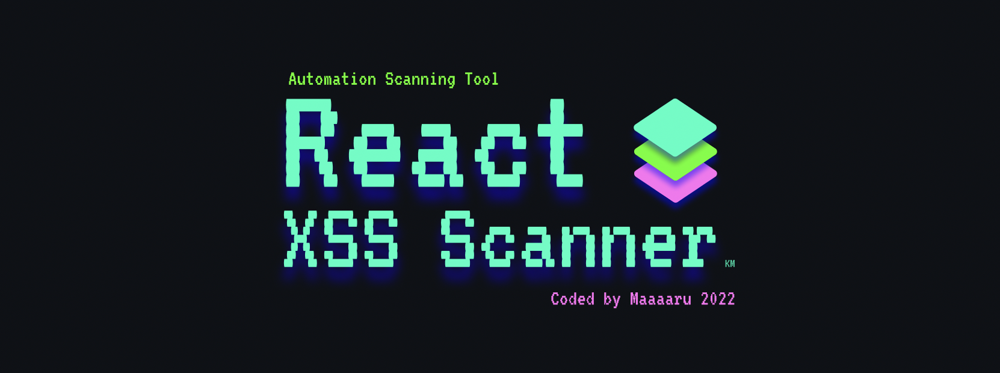

<p align="center">
  
</p>

<h1></h1>

<p align="center">
This scanner for vulnerabilities in React code. (.ts, .tsx, .js, .jsx)
</p>


# What is this
This tool scans files for the presence of dangerous functions that can cause XSS.


# Instalation

clone this repository

```
$ git clone https://github.com/Maaaaru/React-XSS-Scanner.git
```

# Start Scan

```
$ cd React-XSS-Scanner
$ python3 main.py
```

# ※ Caution
The scan results will pick up functions that may cause XSS, so the presence of dangerous code does not necessarily mean that XSS will occur.

Functional accuracy is still being improved.

# Licence

React-XSS-Scanner is licensed under the MIT license. take a look at the [LICENSE](https://github.com/Maaaaru/React-XSS-Scanner/blob/main/LICENSE) for more information.

# Version

Current Version is 1.0.0
